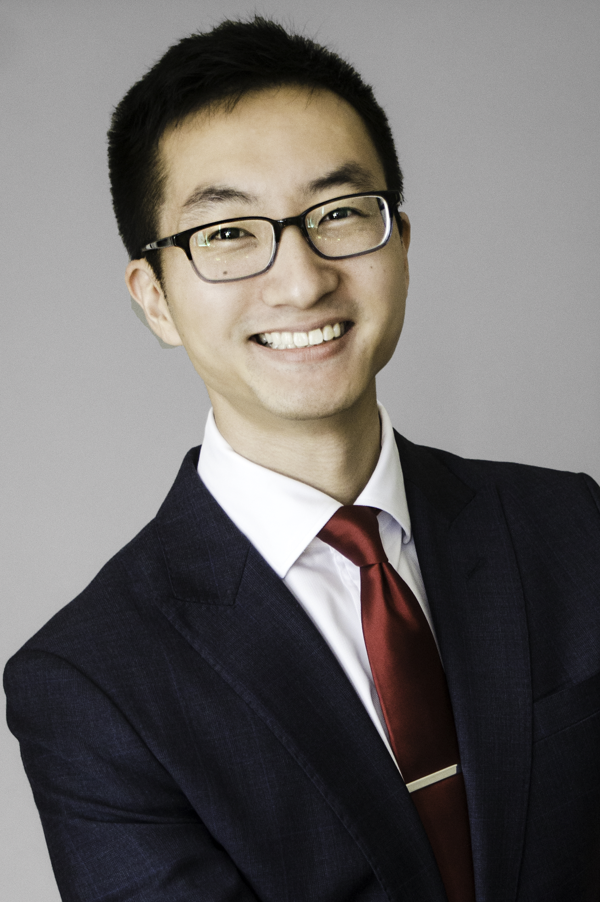

   

<i class='fa fa-twitter fa-fw'></i>  [twitter](http://twitter.com/erikrtn)  
<i class='fa fa-linkedin fa-fw'></i> [linkedin](https://www.linkedin.com/in/erikreinertsen/)  
<i class='fa fa-github fa-fw'></i>  [github](https://github.com/erikrtn)  
<i class='fa fa-graduation-cap fa-fw'></i>  [google scholar](https://scholar.google.com/citations?hl=en&user=APy8nq4AAAAJ&view_op=list_works&sortby=pubdate)  
<i class='fa fa-file-text fa-fw'></i>  [cv](http://erikreinertsen.com/cv)  
<i class='fa fa-envelope fa-fw'></i> <a id="email"></>   

---

MD/PhD student at Emory interested in anesthesiology, data science, and teaching.

Intern at [Takeda Ventures](http://takedaventures.com), an early-stage life science venture capital firm.
 
Published research and patented intellectual property in signal processing and machine learning for physiological time series, neuro-oncology, plastic surgery, and biomaterials.

Cofounded Forge, a nonprofit that helped startups launch clinical pilots.

Holds a PhD in Biomedical Engineering from Georgia Institute of Technology, and a BS in Bioengineering from UCLA. 
